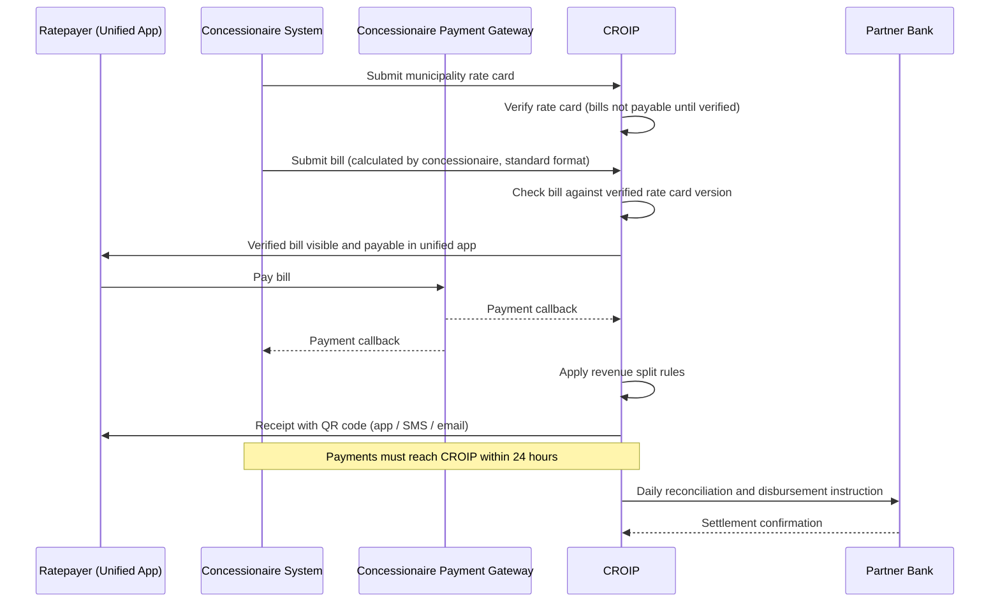

# CROIP — Approach 2: Meeting Notes & Decisions

**Topic:** Approach 2 — Standards-based integration with CROIP as the control point
**Date:** 9 October 2026
**Status:** Working decisions (pending government business rules)

---

## 1. Summary

Under Approach 2, CROIP publishes the standards and APIs. Concessionaires keep running their own operations and systems. CROIP is the single point through which every payment is **acknowledged, receipted and verified**.

Concessionaires get to run things their own way. They do not get to keep collections out of view, because the ratepayer only treats a payment as complete once **CROIP** acknowledges it.

> **Guiding principle:** Concessionaires are independent, but only within guardrails they cannot step outside.

---

## 2. Decisions

### 2.1 Standards-based integration

| # | Decision |
|---|---|
| D1 | CROIP publishes open **APIs and data standards** for property, billing and payment data. |
| D2 | Any concessionaire that conforms to the standards can connect, **whatever system it uses**. CROIP receives the same data set from everyone. |
| D3 | Concessions follow **district assemblies**. Concessionaires can be **onboarded and offboarded** at any time through CROIP's concessionaire management, and a replacement connects to the same published standards. |

### 2.2 Concessionaire autonomy

| # | Decision |
|---|---|
| D4 | Concessionaires keep **their own software** to collect revenue, manage revenue and handle district-specific needs. |
| D5 | Existing concessionaire systems (3–4 players have already built them) are **not replaced** in the early stages. They integrate with CROIP. |
| D6 | **Bill calculation sits with the concessionaire, and CROIP verifies it.** The concessionaire calculates the bill in its own system and submits it to CROIP in the published standard format. |
| D6a | **CROIP verifies the rate card.** Each municipality's rate card must be submitted to CROIP and verified before it is used. |
| D6b | **A bill cannot be paid until the rate card it uses is verified by CROIP.** Bills built on an unverified rate card stay unpayable and do not appear as payable in the ratepayer app. |
| D6c | CROIP checks every submitted bill against the verified rate card version it cites. A bill that doesn't match is rejected back to the concessionaire. |
| D7 | Concessionaires remain responsible for property verification, assessment, field agents and walk-in property registration for ratepayers. |

### 2.3 Unified ratepayer app

| # | Decision |
|---|---|
| D8 | There is **one national ratepayer app**, not a separate app per concessionaire. |
| D9 | The app works in every district, whichever concessionaire manages it, because all data follows the same standard. |

### 2.4 Payments: CROIP as the control point

| # | Decision |
|---|---|
| D10 | Each concessionaire **may use its own payment gateway**. CROIP is not a fintech and does not have to process the payment itself. |
| D11 | The gateway **callback goes to both CROIP and the concessionaire**. This is the start of reconciliation. |
| D12 | **Acknowledgement of payment comes from CROIP, not the concessionaire.** CROIP sends the receipt by app, SMS and email. |
| D13 | Receipts carry a **QR code that is verified against CROIP**, not the concessionaire's system. |
| D14 | Reporting can be **real time or near real time**, but every payment **must reach CROIP within 24 hours**, to allow for outages and connectivity issues. |
| D15 | CROIP handles **central messaging and notifications**. |

**Why this works as a safeguard:** If a ratepayer pays and does not get a CROIP receipt, they will complain. A concessionaire therefore cannot collect money without reporting it. The 24-hour window also means CROIP cannot be used as an excuse against the concessionaire's own KPIs.

### 2.5 Revenue split and disbursement

| # | Decision |
|---|---|
| D16 | **Revenue split rules are a government business decision.** The consortium builds whatever rules government sets. |
| D17 | CROIP applies the split rules **at the point of payment confirmation**. |
| D18 | Collections should **not sit in concessionaire or assembly accounts**. This is the Minister's stated aim, given past misuse. |
| D19 | Disbursement is expected to run **every 24 hours**, through the partner bank's reconciliation and disbursement process. |

**Government decision: disbursement model**

| Option A — Central pool | Option B — Split at payment |
|---|---|
| All collections go into a central pool first. | The split happens at the moment of payment. |
| Government then pays out shares from the pool. | Each share goes straight to its destination account. |
| Matches the Minister's current proposal. | Money reaches recipients faster. Needs gateway or bank support for split settlement. |

**Example (illustrative):** A ratepayer pays a GH₵200 bill.

| Share | % | Amount | Destination |
|---|---|---|---|
| Central pool (government / development) | 50% | GH₵100 | Central account |
| Municipality / concessionaire operations | x% | — | Per government rules |
| Data providers (e.g. NIA, health services) | y% | — | Per government rules |

*Percentages are placeholders until government issues the business rules.*

### 2.6 Governance

| # | Decision |
|---|---|
| D20 | CROIP is built **for government oversight** and is **operated by a government team**. The consortium builds it and hands it over. |
| D21 | Building CROIP (paid by government) is **separate** from any consortium member acting as a concessionaire for specific municipalities. |
| D22 | CROIP has **its own dedicated government team**, independent of every concessionaire and of the consortium, to run the platform and oversee concessionaires. |
| D23 | CROIP has **its own role-based access control (RBAC)** for internal users, from senior oversight officials to system administrators. Access is limited by role and, where relevant, by region or municipality. Every action is recorded in an audit log. |

**CROIP internal roles (proposed)**

| Role | Who | Access |
|---|---|---|
| Executive / Oversight | Minister, senior Ministry officials, CROIP leadership | Read-only national dashboards: revenue billed vs collected, compliance and concessionaire KPIs. Approves policy changes (split rules, disbursement model). |
| Super Admin | CROIP platform lead | Full system configuration. Manages CROIP user accounts and roles. Cannot edit financial records. |
| Concessionaire Manager | CROIP partnerships team | Onboards and offboards concessionaires. Assigns municipalities. Manages API credentials. |
| Rate Card Verifier | CROIP compliance team | Reviews and verifies municipal rate cards. Approves or rejects bills that fail checks. |
| Finance & Reconciliation Officer | CROIP finance team | Reviews payment callbacks and reconciliation. Prepares daily disbursement instructions. |
| Disputes / Support Officer | CROIP support team | Handles ratepayer complaints, missing receipts and QR verification issues. |
| Auditor | Internal audit, Auditor-General | Read-only access to all records and audit logs. |
| System Administrator | CROIP technical team | Infrastructure, integrations, monitoring and messaging. No access to change financial data. |

*Key controls:* separation of duties (for example, the person who verifies a rate card is not the person who approves disbursements), two-person approval for split-rule and disbursement changes, and MFA for every internal role.

---

## 3. Payment flow

---

## 4. What changes from the current Approach 2 page

| Current page | Updated position |
|---|---|
| CROIP routes payments through one partner bank | Concessionaires may use their own gateways. The callback must reach CROIP. |
| CROIP calculates bills from the rate card | **Concessionaire calculates bills**. CROIP verifies the rate card and checks each bill against it. Bills can't be paid until the rate card is verified. |
| "CROIP reconciles and notifies" (no deadline) | CROIP issues the receipt and QR code. **24-hour** reporting deadline. |
| No revenue split or disbursement section | Split rules applied at confirmation, daily disbursement, model chosen by government |
| Concessionaires' own systems not mentioned | Concessionaires keep their own systems and connect through published standards |

---

## 5. Open items

| # | Item | Owner |
|---|---|---|
| O1 | Government to set the revenue split percentages and recipients | Government / Ministry |
| O2 | Government to choose between Option A (central pool) and Option B (split at payment) | Government / Ministry |
| O3 | Confirm daily (24-hour) disbursement frequency with the partner bank | Consortium + Bank |
| O4 | Define the rate card verification process: who approves at CROIP, turnaround time, and how rate card changes are versioned | Consortium + Government |
| O5 | ~~Confirm who will operate CROIP~~ **Closed:** a government team operates CROIP (D20). Still to agree: the handover and training plan, and any consortium support period after handover. | Government + Consortium |
| O6 | Put the Approach 2 diagram on its own slide, update it with these decisions, and review | Team |
